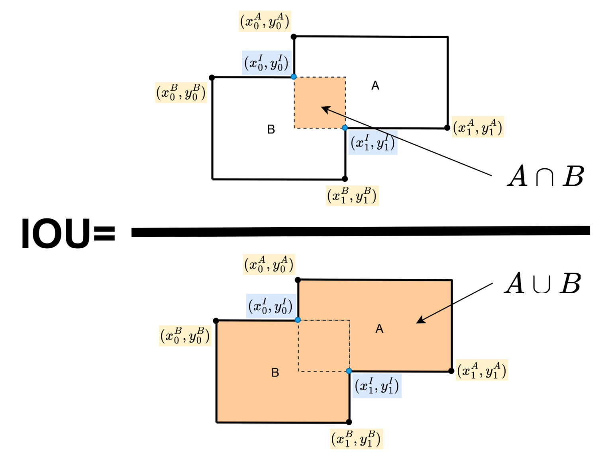
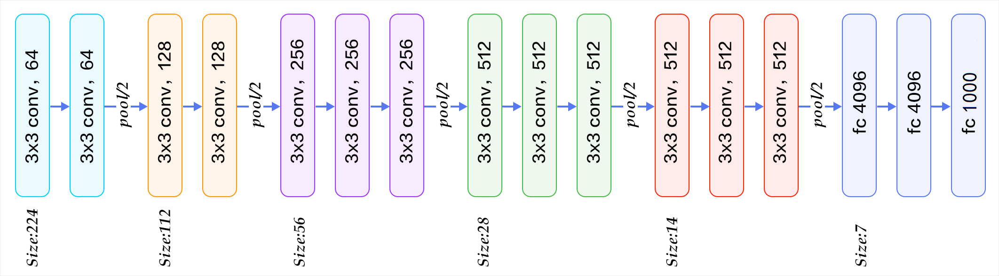

# 实验课 - Object Detection - Part 1

该代码库实现了一个简化版 Faster R-CNN 模型，包括训练、推理代码。

本实验的主要目的：

1. **掌握较为复杂的深度学习模型的实现方法和训练流程。**
2. 通过动手实现 Faster R-CNN，深入理解其核心组件和网络结构。
3. 了解目标检测领域的重要概念。
    - Anchor
    - IoU
    - NMS
    - ROIs
    ...
4. 加深对 Numpy 矩阵运算的理解，尤其广播机制。

[TOC]

## 环境准备

推荐使用 Conda 进行环境管理。

1. 推荐使用 python 3.9
2. 安装 pytorch latest
3. 从 requirements.txt 中安装其他依赖

示例（Windows 10, CPU Only, Conda）：

```bash
conda create -n objectdetection python=3.9  # 创建一个 Conda 环境
pip3 install torch torchvision torchaudio   # 安装命令来自 https://pytorch.org/
pip install -r requirements.txt             # 安装其他依赖
```

PS. 如果运行代码时仍提示缺少某个依赖，请根据报错提示自行安装。

## 整体网络结构

Faster R-CNN 的结构可以分为三个部分：

- Feature Extractor：将输入图像转换成特征图（可以使用任何 Backbone 进行，本实验中使用 VGG16，也可以更换为 Resnet-101 或者其他特征提取网络）
- Region Proposal Network：自动生成 ROIs（通过一系列卷积层）
- ROIHead：对 RPN 提供的 RoIs 进行分类和边界框回归，得到最终的检测结果（通过一系列全连接层）


## 实验

### 1 Base (10min)

#### 1.1 IoU ⭐



IoU 的计算函数位于 `model/utils/bbox_tools.py` 中，函数 `bbox_iou(bbox_a, bbox_b)`，请根据提示以及注释中提供的示例补全缺失部分的代码。

如函数级注释所述，这个函数的输入是两个形状分别为 (N, 4) 和 (K, 4) 的 bbox 数组，`bbox_a` 里面有 N 个 bbox. `bbox_b` 里面有 K 个 bbox, 我们希望计算出所有 N 个 bbox 和所有 K 个 bbox 两两之间的 IoU。以下代码用到了 numpy 中非常重要的广播机制。广播机制有两条规则：

1. 如果两个数组的维度不同，则将维度较少的数组在缺失的维度上进行扩展，直到两个数组的维度相同。
2. 如果两个数组在某个维度上的长度不一致，则将长度为 1 的维度进行扩展，直到两个数组在该维度上的长度相同。

广播机制从后往前匹配两个数组的维度，直到两个数组在该维度上的长度相同。「扩展」意味着复制该维度上的元素。

#### 1.2 NMS

NMS 的作用是去除重叠的检测框。在目标检测中，同一个目标可能会产生多个重叠的检测框。NMS 通过以下步骤去除冗余的检测框：

1. 按照置信度对所有检测框进行排序
2. 选择置信度最高的检测框，将其与其他检测框计算 IoU
3. 去除与该检测框 IoU 大于阈值的其他检测框
4. 重复步骤 2-3，直到所有检测框都被处理完毕

这样可以保留置信度高的检测框，同时去除与其高度重叠的冗余检测框，从而得到更准确的检测结果。

一般情况下，我们无需自行实现 NMS 代码，在 `torchvision.ops` 中提供了 `nms` 函数支持。[📄*官方文档*](https://pytorch.org/vision/main/generated/torchvision.ops.nms.html)

参数分别为：
- boxes (Tensor[N, 4]): 检测框坐标，格式为 (x1, y1, x2, y2)
- scores (Tensor[N]): 检测框的置信度分数
- iou_threshold (float): IoU 阈值，用于判断两个检测框是否重叠

返回值为保留的检测框的索引 (Tensor[K])，其中 K <= N

### 2 Model Architecture

模型主要包括三个部分，分别是特征提取网络（Feature Extractor）、区域建议网络（Region Proposal Network）和 ROI 头部网络（ROIHead）。特征提取网络负责从输入图像中提取特征图，区域建议网络基于特征图生成候选区域（ROIs），ROI 头部网络则对这些候选区域进行分类和边界框回归，得到最终的检测结果。

#### 2.1 Overall（入口）

函数位于 `model/faster_rcnn.py, class FasterRCNN`，函数 `forward(self, x, scale=1.0)` 中。输入图像首先经过 `extractor` 提取特征图，特征图送入 `rpn` 生成 RoIs，之后特征图和 RoIs 一起送入 `head` 预测得到最后的结果。

#### 2.2 Feature Extractor (3min)

任务汇总：
- `model/faster_rcnn_vgg16.py` func: `decom_vgg16` 阅读，并根据提示补全缺失代码。
- `model/faster_rcnn_vgg16.py, class FasterRCNNVGG16`, func: `__init__` 补全 `extractor, classifier = ...` 部分，也就是特征提取器以及用于 ROIHead 的分类器的初始化代码。

实现代码位于 `model/faster_rcnn_vgg16`，函数 `decom_vgg16` 中。在本实现中，我们使用 VGG16 作为特征提取的 Backbone 但只使用全连接之前的层，VGG 的全连接层被用于 ROIHead 中。

VGG16 的网络结构如下所示，请根据提示补全缺失部分代码。

PS. 为了降低训练成本，将前四个卷积层的参数冻结，不参与训练。



具体 Layers 的输出如下：

```
VGG(
  (features): Sequential(
    (0): Conv2d(3, 64, kernel_size=(3, 3), stride=(1, 1), padding=(1, 1))
    (1): ReLU(inplace)
    (2): Conv2d(64, 64, kernel_size=(3, 3), stride=(1, 1), padding=(1, 1))
    (3): ReLU(inplace)
    (4): MaxPool2d(kernel_size=2, stride=2, padding=0, dilation=1, ceil_mode=False)
    (5): Conv2d(64, 128, kernel_size=(3, 3), stride=(1, 1), padding=(1, 1))
    (6): ReLU(inplace)
    (7): Conv2d(128, 128, kernel_size=(3, 3), stride=(1, 1), padding=(1, 1))
    (8): ReLU(inplace)
    (9): MaxPool2d(kernel_size=2, stride=2, padding=0, dilation=1, ceil_mode=False)
    (10): Conv2d(128, 256, kernel_size=(3, 3), stride=(1, 1), padding=(1, 1))
    (11): ReLU(inplace)
    (12): Conv2d(256, 256, kernel_size=(3, 3), stride=(1, 1), padding=(1, 1))
    (13): ReLU(inplace)
    (14): Conv2d(256, 256, kernel_size=(3, 3), stride=(1, 1), padding=(1, 1))
    (15): ReLU(inplace)
    (16): MaxPool2d(kernel_size=2, stride=2, padding=0, dilation=1, ceil_mode=False)
    (17): Conv2d(256, 512, kernel_size=(3, 3), stride=(1, 1), padding=(1, 1))
    (18): ReLU(inplace)
    (19): Conv2d(512, 512, kernel_size=(3, 3), stride=(1, 1), padding=(1, 1))
    (20): ReLU(inplace)
    (21): Conv2d(512, 512, kernel_size=(3, 3), stride=(1, 1), padding=(1, 1))
    (22): ReLU(inplace)
    (23): MaxPool2d(kernel_size=2, stride=2, padding=0, dilation=1, ceil_mode=False)
    (24): Conv2d(512, 512, kernel_size=(3, 3), stride=(1, 1), padding=(1, 1))
    (25): ReLU(inplace)
    (26): Conv2d(512, 512, kernel_size=(3, 3), stride=(1, 1), padding=(1, 1))
    (27): ReLU(inplace)
    (28): Conv2d(512, 512, kernel_size=(3, 3), stride=(1, 1), padding=(1, 1))
    (29): ReLU(inplace)
    (30): MaxPool2d(kernel_size=2, stride=2, padding=0, dilation=1, ceil_mode=False)
  )
  (avgpool): AdaptiveAvgPool2d(output_size=(7, 7))
  (classifier): Sequential(
    (0): Linear(in_features=25088, out_features=4096, bias=True)
    (1): ReLU(inplace)
    (2): Dropout(p=0.5)
    (3): Linear(in_features=4096, out_features=4096, bias=True)
    (4): ReLU(inplace)
    (5): Dropout(p=0.5)
    (6): Linear(in_features=4096, out_features=1000, bias=True)
  )
)
```

#### 2.3 Region Proposal Network (15min)

任务汇总：
- `model/utils/bbox_tools.py`, func: `generate_anchor_base` 请阅读该函数的注释并确保完全理解了 Base Anchor 的创建过程，包括如何通过 `scale, ratio, base_size` 计算 Anchor 的宽和高，之后补全代码中 `h, w` 的计算。
- `model/region_proposal_network.py`, func: `_enumerate_shifted_anchor` 请阅读该函数提供的注释，理解矩阵的操作过程，并根据我提供的示例补全 `anchor` 的计算过程。
- `model/region_proposal_network.py`, func: `__init__` 补全 `self.conv1, self.score, self.loc` 三个卷积层。
- `model/faster_rcnn_vgg16.py, class FasterRCNNVGG16`, func: `__init__` 补全 `rpn = ...` 部分，也就是 RPN 的初始化代码。
- `model/utils/creator_tool.py, class ProposalCreator`, func: `__call__` 补全 `nms` 代码。
- `model/utils/bbox_tools.py`, func: `loc2bbox` 补全偏移转换部分的代码。

##### 2.3.1 Build Anchor ⭐

Anchor 是 Faster R-CNN 一个大创新点，使用 Anchor 可以在特征图上生成大量不同尺度和长宽比的候选框。这种方式相比之前的滑动窗口和 Selective Search 等方法更加高效和灵活。Anchor 机制使得网络能够同时处理不同大小和形状的目标，显著提高了检测的准确性和鲁棒性。请注意：虽然 Anchor 的中心点是在特征图上生成的，但是这些点会映射回原图，并在原图的尺度上生成 Anchor 而非特征图。具体的生成过程如下：

1. 在特征图上生成一个网格，每个网格点作为一个 Anchor 的中心点
2. 将特征图上的中心点坐标乘以特征图的步长（stride），得到原图上的中心点坐标
3. 以这些中心点为基准，生成不同尺度（scale）和长宽比（ratio）的 Anchor
4. 每个中心点会生成 k 个 Anchor，其中 k = len(scales) × len(ratios)
5. 最终生成的 Anchor 数量为 \[宽 × 高 × k\]

在 Faster R-CNN 中，我们使用三种尺度（scales=[8, 16, 32]）和三种长宽比（ratios=[0.5, 1, 2]）来生成 Anchor，因此每个中心点会生成 9 个不同的 Anchor。这些参数的选择是基于大量实验得出的经验值，能够较好地覆盖不同大小和形状的目标。其中，scales 表示 Anchor 的边长相对于特征图的步长（在代码中是 16）的倍数，ratios 表示 Anchor 的宽高比。

在代码实现中，我们首先需要根据 scales 和 ratios 创建 Base Anchor，具体而言，我们找到最左上角的点作为基准点，然后根据 scales 和 ratios 生成不同大小和长宽比的 Anchor。这个过程在 `model/utils/bbox_tools.py` 中的 `generate_anchor_base` 函数中实现。该函数首先计算基准点的坐标（base_size/2, base_size/2），然后对每个 scale 和 ratio 的组合，计算对应的宽和高：

- h = base_size * scale * sqrt(ratio)
- w = base_size * scale * sqrt(1/ratio)

最后将这些宽高转换为 Anchor 的四个坐标（y_min, x_min, y_max, x_max）。这样我们就得到了一组基础的 Anchor，它们都以基准点为中心，但具有不同的大小和形状。

该部分的相关函数位于 `model/utils/bbox_tools.py` 函数 `generate_anchor_base(base_size=16, ratios=[0.5, 1, 2], anchor_scales=[8, 16, 32])` 中。请阅读代码和注释以确保理解整个生成过程，并补全缺失代码。

之后，我们计算所有可能的偏移量，并在 Base Anchor 上生成所有 Anchor，函数位于 `model/region_proposal_network.py` 函数 `_enumerate_shifted_anchor(anchor_base, feat_stride, height, width)` 中，请根据提示和注释补全缺失部分代码。

##### 2.3.2 预测分支 ⭐


在输入 RPN 的预测分支之前，特征图首先通过卷积层提取特征（这个卷积层通常是一个 3×3 的卷积层，输出通道数是 256 或者 512），然后通过两个并行的 1x1 卷积层分别预测前景/背景分类和边界框回归。其中，分类分支输出的通道数为 2 × n_anchor，表示每个 anchor 的前景和背景概率；回归分支输出的通道数为 4 × n_anchor，表示每个 anchor 相对于 ground truth 的偏移量（dx, dy, dw, dh）。

相关代码位于 `model/region_proposal_network.py` 类 `class RegionProposalNetwork` 中，RPN 会使用卷积输出两个结果，一个是前后景的二分类，另一个是对 Anchor 的边界框回归。其中，分类分支输出的通道数为 `2 × n_anchor`，回归分支输出的通道数为 `4 × n_anchor`。之后这些结果会送入到 `proposal_layer` 生成最后的 ROIs 结果。请根据提示补全关于预测分支的代码。

##### 2.3.3 Proposal Creater ⭐

相关代码位于 `model/utils/creator_tool.py, class ProposalCreator` 函数 `__call__` 中，主要是对上述预测分支的结果进行后处理生成最后的 ROIs 结果。具体步骤如下：

1. 对预测的边界框进行解码，将相对于 Anchor 的偏移量转换为实际的边界框坐标
2. 根据前景分数对所有边界框进行排序，选取前 pre_nms_topN 个边界框
3. 对这些边界框进行 NMS 处理，去除重叠度较高的冗余框
4. 从 NMS 的结果中选取前 `post_nms_topN` 个边界框作为最终的 ROIs
5. 如果 ROIs 数量少于 `post_nms_topN` 则用 0 填充到指定数量

请根据提示补全关于应用 NMS 过滤的部分。

另外，请关注偏移量（预测偏移量，格式为 dx, dy, dw, dh，其中 dx, dy 表示中心点的偏移量，dw, dh 表示宽高的缩放量）是如何转换到实际的边界框坐标的，相关代码位于 `model/utils/bbox_tools.py` 函数 `loc2bbox(src_bbox, loc)` 中。请根据注释以及公式补充缺失代码。

公式如下：

$$
\begin{aligned}
& x^{\prime}=w d_x+x \\
& y^{\prime}=h d_y+y \\
& w^{\prime}=w \cdot \exp \left(d_w\right) \\
& h^{\prime}=h \cdot \exp \left(d_h\right)
\end{aligned}
$$

#### 2.4 ROIHead (7min)

相关代码位于 `model/faster_rcnn_vgg16.py, class VGG16RoIHead` 下，该部分主要负责对 RPN 生成的 ROIs 进行分类和边界框回归。具体来说，ROIHead 会将每个 ROI 区域通过 ROI Pooling 层转换为固定大小的特征图，然后通过 VGG16 的全连接层进行特征提取，最后通过两个分支分别进行分类和边界框回归预测。其中分类分支输出的通道数为类别数量，回归分支输出的通道数为 `n_class × 4`（注意：这里的 `n_class` 包括背景类）。

任务汇总：
- `model/faster_rcnn_vgg16.py, class VGG16RoIHead` func: `__init__` 补全 `self.roi = ...` 部分。 
- `model/faster_rcnn_vgg16.py, class VGG16RoIHead` func: `__init__` 补全 `self.roi, self.score` 的声明部分。
- `model/faster_rcnn_vgg16.py, class VGG16RoIHead` func: `forward` 应用分类器以及预测分支部分。
- `model/faster_rcnn_vgg16.py, class FasterRCNNVGG16`, func: `__init__` 补全 `head = ...` 部分，也就是 ROIHead 的初始化代码。

##### 2.4.1 ROIPool ⭐

和 NMS 部分一样，一般情况下我们无需手动实现该部分代码，Pytorch 在 `torch.ops.torchvision.ROIPool` 中已经提供了相关功能。[📄*官方文档*](https://pytorch.org/vision/stable/generated/torchvision.ops.RoIPool.html)

ROIPool 会将不同大小的 ROI 区域池化为固定大小的特征图。具体来说，它会将每个 ROI 区域划分为固定数量的网格（由 output_size 参数指定），然后对每个网格内的特征进行最大池化操作。`spatial_scale` 参数用于将 ROI 坐标从输入图像的尺度映射到特征图的尺度。最后，我们将 ROIPool 的输出展平输入到预测分支中。

注意：`spatial_scale` 是 `stride` 的倒数。

请根据 `torch.ops.torchvision.ROIPool` 的用法补充 `model/faster_rcnn_vgg16.py, class VGG16RoIHead` 函数 `__init__` 中的 `self.roi =` 部分。

##### 2.4.2 预测分支 ⭐

相关代码位于 `model/faster_rcnn_vgg16.py, class VGG16RoIHead` 函数 `forward` 中。一个分支预测多分类，一个分支预测边界框回归。其中，分类分支输出的通道数为类别数量（包括背景类），回归分支输出的通道数为 `n_class × 4`。请根据提示补全关于预测分支的代码。

### 3 How to create ground true labels and calculate loss? (10min)

Faster R-CNN 总共包含四个损失：

1. RPN 分类损失：判断 Anchor 是前景还是背景
2. RPN 回归损失：预测 Anchor 相对于 Ground Truth 的偏移量，偏移量的计算方法是：
   - $t_x = (x - x_a) / w_a$
   - $t_y = (y - y_a) / h_a$  
   - $t_w = log(w / w_a)$
   - $t_h = log(h / h_a)$

   其中 $(x,y,w,h)$ 是 Ground Truth 的中心坐标和宽高，$(x_a,y_a,w_a,h_a)$ 是 Anchor 的中心坐标和宽高，使用 Smooth L1 Loss 计算
3. ROIHead 分类损失：判断 ROI 属于哪个类别
4. ROIHead 回归损失：预测 ROI 相对于 Ground Truth 的偏移量

更加细节的架构图如下：


该部分代码位于 `trainer.py` 函数 `forward` 中。

任务汇总：
- `model/utils/creator_tool.py, class AnchorTargetCreator` func: `_create_label` 补全关于如何确定正负中样本的代码行。
- `model/utils/creator_tool.py, class ProposalTargetCreator` func: `__call__` 补全关于如何确定正负样本的代码行。
- `trainer.py, class FasterRCNNTrainer` func: `forward` 补全所有损失函数计算的缺失部分。

#### 3.1 ROIHead Loss ⭐

ROIHead 的损失是比较好计算的，我们只需要 Ground Truth 的 BBox 和 Class Labels 即可，损失计算如下：

1. 分类损失：使用交叉熵损失，将 ROI 的预测类别与真实类别进行比较
2. 回归损失：对于每个正样本 ROI，计算其相对于对应 Ground Truth 的偏移量，使用与 RPN 相同的编码方式，并同样使用 Smooth L1 Loss 计算

至于如何确定正样本，我们需要计算每个 ROI 与所有 Ground Truth 的 IoU。如果一个 ROI 与某个 Ground Truth 的 IoU 大于阈值（通常为 0.5），则将其标记为该类的正样本。如果 IoU 小于阈值，则标记为背景类（负样本）。对于每个 Ground Truth，我们选择与其 IoU 最大的 ROI 作为正样本，即使 IoU 小于阈值，这样可以确保每个 Ground Truth 都有对应的正样本。

相关代码位于 `model/utils/creator_tool.py, class AnchorTargetCreator` 函数 `_create_label` 中，请根据上述过程补充缺失代码。

#### 3.2 RPN Loss ⭐

RPN 的损失计算就涉及了一个问题，如何生成 GT Labels？具体而言，我们需要为每个 Anchor 生成两类标签：

1. 分类标签：判断 Anchor 是前景还是背景
    - 如果 Anchor 与某个 Ground Truth 的 IoU 大于正样本阈值（通常为 0.7），则标记为前景
    - 如果 Anchor 与所有 Ground Truth 的 IoU 都小于负样本阈值（通常为 0.3），则标记为背景
    - 介于两者之间的 Anchor 不参与训练
    - 对于每个 Ground Truth，选择与其 IoU 最大的 Anchor 作为正样本，即使 IoU 小于阈值

2. 回归标签：对于每个正样本 Anchor，计算其相对于对应 Ground Truth 的偏移量
    - 使用前面提到的编码方式计算偏移量
    - 只有正样本 Anchor 需要计算回归标签，负样本和忽略样本的回归标签不参与损失计算

再度重申，正样本 Anchor 是指满足以下任一条件的 Anchor：

1. 与某个 Ground Truth 的 IoU 大于正样本阈值（0.7）的 Anchor
2. 对于每个 Ground Truth，与其 IoU 最大的那个 Anchor（即使 IoU 小于 0.7）

同时，通过代码控制正负样本的生成比例。这样的设计确保了：

- 每个 Ground Truth 至少有一个对应的正样本 Anchor 用于训练
- 高质量匹配（高 IoU）的 Anchor 都被用作正样本
- 避免产生过多的正样本，保持正负样本的平衡

相关代码位于 `model/utils/creator_tool.py, class ProposalTargetCreator` 函数 `__call__` ，请根据上述过程补充缺失代码。

#### 3.3 Total Loss ⭐

在了解了 ROIHead Loss 和 RPN Loss 的计算方式后，我们可以总结一下整个 Faster R-CNN 的损失计算过程：

1. RPN 损失
   - 分类损失：使用交叉熵损失，判断 Anchor 是前景还是背景
   - 回归损失：使用 Smooth L1 Loss，计算正样本 Anchor 相对于 Ground Truth 的偏移量

2. ROIHead 损失
   - 分类损失：使用交叉熵损失，判断 ROI 属于哪个具体类别
   - 回归损失：使用 Smooth L1 Loss，计算正样本 ROI 相对于 Ground Truth 的偏移量

总损失函数为：

$L = L_{rpn\_cls} + L_{rpn\_loc} + L_{roi\_cls} + L_{roi\_loc}$

其中各项损失的权重默认都为 1。这四项损失通过反向传播共同优化网络参数，使模型能够同时：

- 准确区分前景和背景（RPN 分类）
- 精确定位候选区域（RPN 回归）
- 正确分类目标（ROIHead 分类）
- 精细调整边界框（ROIHead 回归）

相关代码位于 `trainer.py, class FasterRCNNTrainer` 函数 `forward` 中，请补全缺失代码。

### 4 Prepare Dataset (5min) ⭐

数据集下载：
- [百度网盘](https://pan.baidu.com/s/1casvnVrItKtksQe96nVA5Q?pwd=s5ee)
- [Google Drive](https://drive.google.com/file/d/1qrYau4KttpeOmDbyzDHtC7ZXbjrFhq_Q/view?usp=drive_link)

任务汇总：
- `data/voc_dataset.py, class VOCBboxDataset` func: `get_example` 无需补全，但请阅读该函数，确保掌握数据处理流程。
- `data/dataset.py, class Dataset` 根据 `class TestDataset` 补全代码。

### 5 Train! (25min) ⭐

任务汇总：
- `model/faster_rcnn.py, class FasterRCNN` func: `forward, _suppress` 请阅读以上函数并确保理解其处理流程。
- `train.py` func: `train` 请阅读该函数并回顾上述所有流程。
- `trainer.py, class FasterRCNNTrainer` func: `forward` 请阅读该函数并回顾上述所有流程。
- `trainer.py, class FasterRCNNTrainer` func: `train_step` 补全缺失代码。

在训练开始之前还有最后一个问题，就是 ROIHead 输出预测之后如何得到最后的结果，该部分代码位于 `model/faster_rcnn.py` 函数 `predict` 中。主要经过以下几个步骤：
- 预处理输入图像，包括归一化和调整大小
- 通过特征提取网络提取特征
- RPN 网络生成候选区域 (RoIs)
- ROIHead 对每个 RoI 进行分类和边界框回归
- 使用非极大值抑制 (NMS) 去除重叠的检测框
- 根据置信度阈值过滤低置信度的检测结果
- 将预测结果转换回原始图像尺寸

训练函数的整体代码位于 `trainer.py` 函数 `forward` 中，总入口（包括日志和可视化以及模型保存）位于 `train.py` 函数 `train` 中。

运行如下命令开始训练：

```bash
python -m visdom.server  # 启动 visdom 进行可视化，如果在 Github Codespace 上运行需要添加 --host 0.0.0.0 并使用 Codespace 提供的链接

# open another terminal to start training
python train.py train --plot-every 10 --voc-data-dir path/to/VOC2007
```

注意：关于训练的配置全部写在 `utils/config.py` 中，你可以根据自己的需求修改相关参数（强烈推荐这种写法）。

如果报错，请根据报错检查自己填写的代码是否产生错误。如遇到困难，请善用搜索引擎、GPT 以及助教。